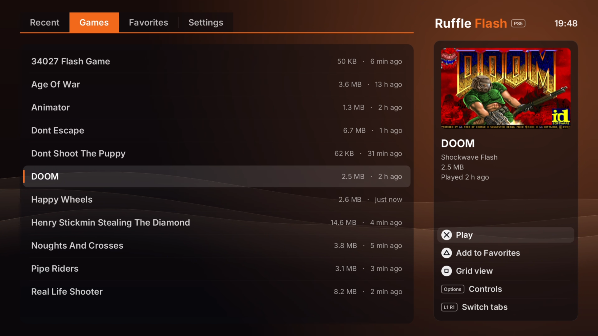

<p align="center">
  
</p>

<h1 align="center">Ruffle Flash PS5</h1>

<p align="center">
  <b>Flash games, running natively on PlayStation 5.</b><br>
  A port of <a href="https://ruffle.rs">Ruffle</a>, the open-source Flash Player emulator, as a native PS5 app.
</p>

<p align="center">
  
  
  
  
  
</p>

---

<p align="center">
  
</p>

## Features

- Plays `.swf` games and animations (ActionScript 1, 2 and 3), rendered on the PS5's GPU.
- Library with **Recent**, **Games** and **Favorites** tabs, list or grid view, and covers taken automatically from your games.
- **Controls per game**: map any DualSense button to a key or a mouse click.
- **On-screen keyboard** L2 to run it, some games needs keyboard.
- Ruffle's own player settings: quality, scale mode, letterbox, frame rate, player version and more.
- Sound with MP3, AAC and Nellymoser support.

## Install

You need a PS5 with **kstuff** running and a ruffle-helper, plus **[ShadowMountPlus](https://github.com/drakmor/ShadowMountPlus)**.

Download the [latest release](https://github.com/ZiZc3/Ruffle-Flash-PS5/releases), then:

1. Copy the **`PPSA68091`** folder to `/data/homebrew/`.
2. Load **`ruffle-helper.elf`** together with kstuff.
3. Put all your games (.swf) in `/data/ruffle/games/`.
4. Start **Ruffle Flash** from the home screen.

## Controls

**Library**

| Button | Action |
|---|---|
| D-Pad | Move |
| ✕ | Play / select |
| ○ | Back |
| △ | Add to favorites |
| □ | List / grid view |
| Options | Controls for this game |
| L1 / R1 | Switch tabs |

**In game** (defaults; change them per game with Options in the library)

| Button | Action |
|---|---|
| Left stick | Mouse cursor (or arrow keys / WASD) |
| ✕ | Mouse click |
| ○ / □ / △ | Z / Space / Enter |
| L1 / R1 / R2 | Shift / X / O |
| D-Pad | Arrow keys |
| Options / Create / L3 | Esc / P / Ctrl |
| Right stick | Scroll |
| L2 | On-screen keyboard |
| R3 | Take a new cover |
| **Touchpad click** | Back to the library |

## Folders on the PS5

| Path | What |
|---|---|
| `/data/ruffle/games/` | Your games (`.swf`) |
| `/data/ruffle/covers/` | Covers (`.png` / `.jpg`, named like the game) |
| `/data/ruffle/saves/` | Game saves (only games that supported) |
| `/data/ruffle/controls/` | Per-game controls |
| `/data/ruffle/ruffle.log` | Log of the last session (attach it when reporting a problem) |
> Games that come with extra files (folders like `db/` or `media/`) go in a folder of their own, with all their files, e.g. `/data/ruffle/games/Happy Wheels/`.

## Good to know

- There is no internet: online-only parts of games (ads, high scores, logins) are skipped.
- Very heavy ActionScript 3 games can run below full speed; most games run at their full frame rate.
- Flash videos in H.264 are not supported.
- Compatibility follows Ruffle: if a game works in Ruffle on PC, it most likely works here.

## How Rust runs on the PS5

Ruffle is written in Rust, and Rust has no PS5 target. This is how the app gets there:

| Problem | Solution |
|---|---|
| No Rust target for the PS5 | A custom target, [`x86_64-ps5-freebsd.json`](x86_64-ps5-freebsd.json) (FreeBSD-based, Zen 2), with Rust's `std` built from source (`-Zbuild-std`). |
| No thread-local storage for apps | The target sets `has-thread-local: false`, so `std` keeps its thread locals in pthread keys. |
| The PS5's libc is FreeBSD 11 | `std` built for FreeBSD 11's ABI (`libc_unstable_freebsd_version="11"`), with small wrappers for `stat` and `readdir`. |
| Functions `std` expects but the PS5 lacks | Small C shims ([`ps5_rust_shims.c`](ps5/scripts/ps5_rust_shims.c)) kept private to the app. |
| Linking a PS5 app | [`ps5-link.sh`](ps5/scripts/ps5-link.sh) is Cargo's linker: it links with the PS5 toolchain, the app runtime and RADV; [`package.sh`](ps5/scripts/package.sh) signs the `eboot.bin`. |
| Start-up | [`ps5_early.c`](ps5/scripts/ps5_early.c) runs before Rust: log file, crash handler, helper request. |
| Graphics | Ruffle's wgpu renderer on Vulkan, through [Mihawk-99](https://github.com/mihawk-99)'s RADV driver, shown on a 4K display swapchain. |
| Controller and sound | DualSense through `libScePad`, sound through `SceAudioOut`, its thread on a CPU core of its own. |

The few changes to Ruffle and wgpu are in [`patches/`](patches).

## Building

On Linux (WSL2 Ubuntu works), with [PS5_Vulkan](https://github.com/mihawk-99/PS5_Vulkan) built in `~/ps5/PS5_Vulkan`, Rust nightly with `rust-src`, and Java (for Ruffle's build):

```sh
bash ps5/scripts/build.sh
```

It downloads Ruffle, applies the patches, builds the app and writes `PPSA68091/` and `PPSA68091.zip`.
The helper builds with `make` in [`ruffle-helper/`](ruffle-helper) (needs `PS5_PAYLOAD_SDK`).

## Credits
- **[Ruffle](https://github.com/ruffle-rs/ruffle)** and its contributors: the Flash Player emulator.
- **[Mihawk-99](https://github.com/mihawk-99)**: [PS5_Vulkan](https://github.com/mihawk-99/PS5_Vulkan), RADV on the PS5.
- **[ps5-payload-dev SDK](https://github.com/ps5-payload-dev/sdk)**, **[kstuff](https://github.com/EchoStretch/kstuff)**, **[etaHEN](https://github.com/LightningMods/etaHEN)**, **[ShadowMountPlus](https://github.com/drakmor/ShadowMountPlus)** and the PS5 scene.
- **[Inter](https://rsms.me/inter/)** font by Rasmus Andersson.

## License

Ruffle Flash PS5 is licensed under the **GNU General Public License v3.0** (see [`LICENSE`](LICENSE)).
Ruffle itself is MIT or Apache-2.0 (see [`LICENSE-RUFFLE.md`](LICENSE-RUFFLE.md)).
No games are included. Ruffle Flash PS5 is a fan project, not affiliated with Sony, Adobe or the Ruffle project.
